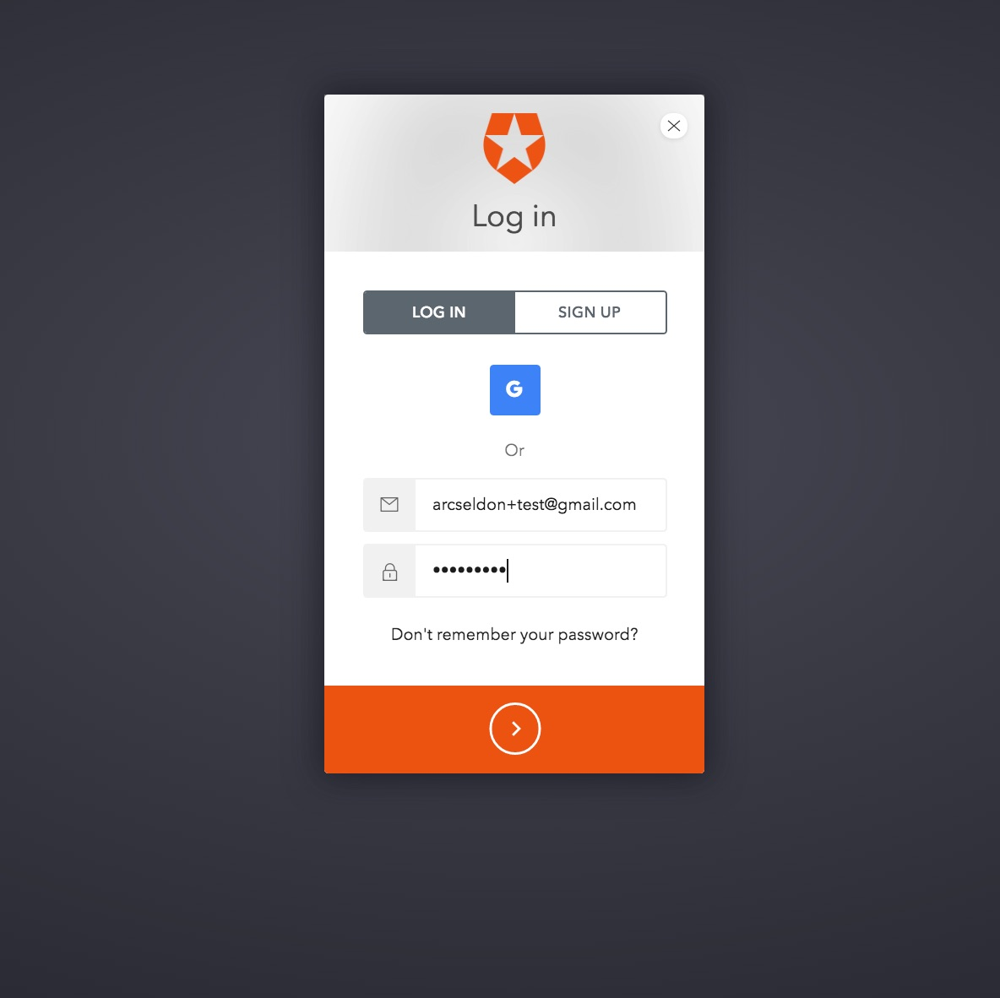
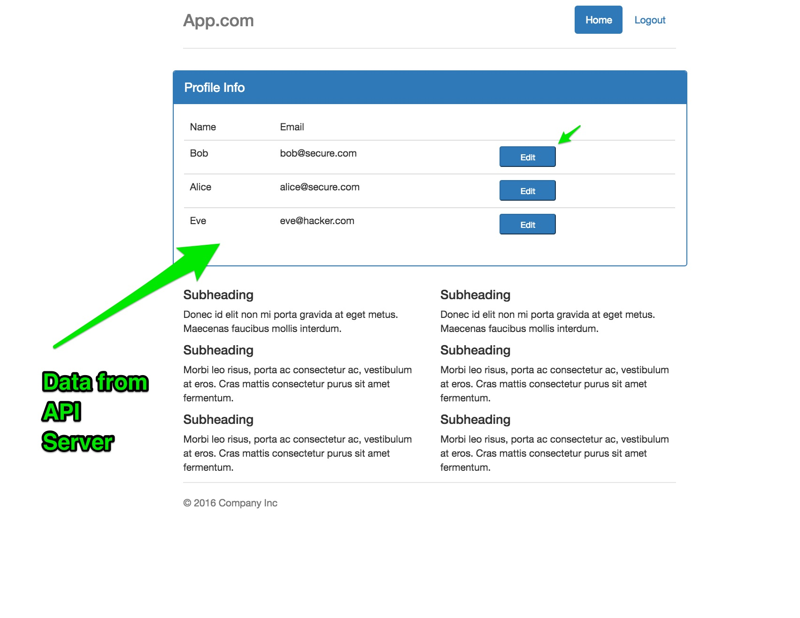

## Auth0 (AngularJS) Single Page Application + API Server Sample

This is a companion `client` sample for the [Auth0 Spring Security API Sample](https://github.com/auth0-samples/auth0-spring-security-api-sample).

Please refer to that sample and documentation to get your API Server up and running. There is no specific dependency on that implementation from a technology perspective, but both this sample has been coded as a Client for RESTful service endpoints provided by that API Server sample.

The purpose of this sample is to provide an easy to understand seed project for users wishing to combine Java Spring Security API Server with a single page application front-end.

### Configuring the sample

Update `auth0-variables` providing your `client_id`, `domain` and `api_server_endpoint`.  Example below:

```
var AUTH0_CLIENT_ID='eTxxxxypLq2LcxxxxhYL6xxxxMDh';
var AUTH0_DOMAIN='arcseldon.auth0.com';
var API_SERVER_URL='http://localhost:3001/';
```

### Running the example

In order to run the example you need to just start a server. What we suggest is doing the following:

1. Install node
1. run npm install -g serve
1. run serve in the directory of this project.

Go to [http://localhost:3000](http://localhost:3000)

### Screen Shots

##### Login using Lock



##### Home Page - Profile Administration



##### Update Profile


### Background Information

For the sake of simplicity, build tools and steps (minification etc), and dependency management with tools such as `bower` have been avoided. This sample instead focuses on successful authentication with Auth0, and subsequent secured API calls to an external API Server hosted on a different web server.

1). For the current implementation, the SPA and API Server trust one another, and share the same Auth0 `application` information. Hence the JWT Token received upon successful authentication in the SPA application is also passed in the Authorization Bearer header of the AJAX requests to the API Server. The API Server accepts the audience as it is the same as its own.

However, different scenarios that shall be provided shortly will include:

2). Using Delegation Tokens to partition the SPA application and API Server, each having their own Auth0 Application on a shared Tenant.

3). Using a Resource Server, rather than API Server. This scenario shall be a companion `client` sample for the [Auth0 Spring Security API Resource Server Sample](https://github.com/auth0-samples/auth0-spring-security-api-resource-server-sample).

It is expected that most of the code solution provided here remains the same, just require a few key changes to the way in which the Authentication / Authorization process is handled and the claims contents of the received JWT Token used for authorization against the external API / Resource Server.
